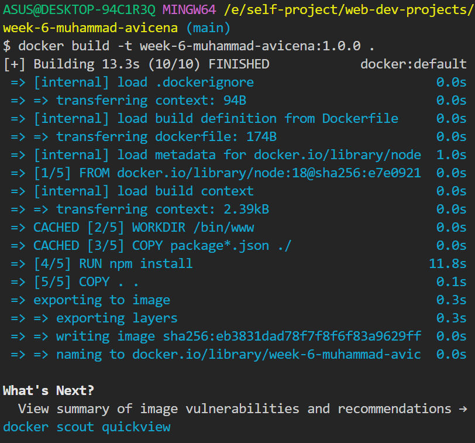
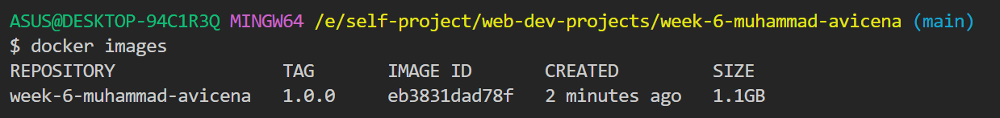
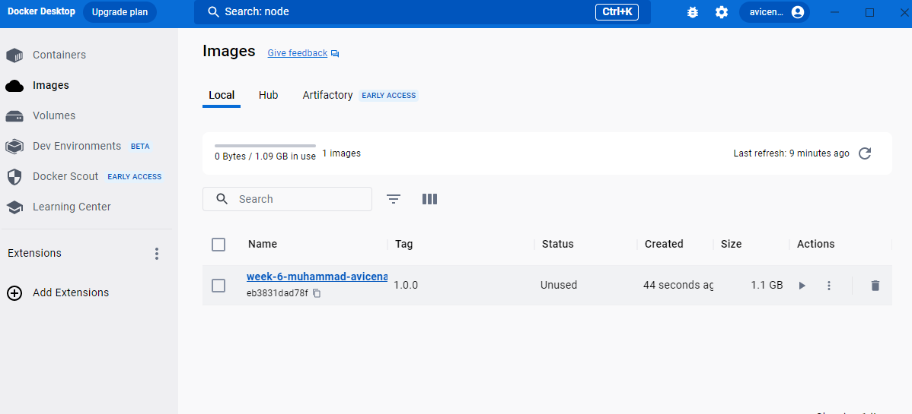
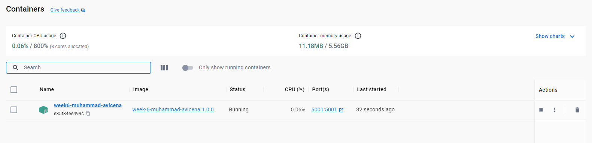
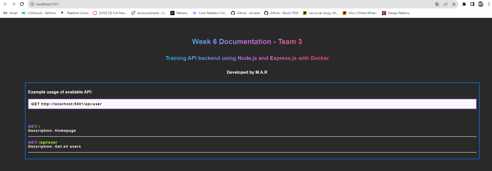

<h1 align="left">Fancy to see you here !  </h1>

hi, I'm Muhammad Avicena. In this repository, I build simple back-end API using Node.js & Express.js, made up with "npx express generator" & it can be run in Docker container. I hope you like it !

I am committed to staying up-to-date with industry trends and using the latest tools to develop innovative solutions that surpass expectations.
Interested to have collaboration ? Find me on:

[](https://www.linkedin.com/in/muhammad-avicena/)
[](https://www.youtube.com/@MuhammadAvicena)
[](https://www.instagram.com/ryuhideaki.dev/)
[](mailto:cenarahmant.dev@gmail.com)

# Technologies & Tools ⚡ 

- Node.js
  - Express.js
- Docker


# Installation and Deployment ⚙️
### Get to know Docker !
Using Docker, you can quickly deploy and scale applications into any environment and know your code will run.

1. You will need to have docker application, kindly refer to this website & install based on your Operating system  [Docker Website](https://www.docker.com/)
2. After the installation done, you can check docker version in terminal/command promopt
    ```
    docker --version
    Docker version 24.0.2, build cb74dfc
    ```
### Now we can create our application and deploy in Docker !
3. I use the application generator tool ["npx express-generator"](https://expressjs.com/en/starter/generator.html) 
command, which can create an instant application skeleton. 
    ```
    # create from scratch
    npx express-generator
    or
    # simply clone my repository to get modified version
    git clone https://github.com/RevoU-FSSE-2/week-6-muhammad-avicena
    ```
4. Create "Dockerfile" and configure the following steps: 
    ```
    # It will install node.js with latest version
    FROM node:latest

    # It's setting the working directory to a specific location inside the container
    WORKDIR /app

    # Copying all the files from local source location to a specific container inside docker
    COPY . .

    # It will install all the depedencies that needed from package.json
    RUN npm install 

    # It will execute the Docker image specified by following command
    CMD ["node", "./bin/www"]
    ```
5. Build the image using the dockerfile.
    ```
    docker build -t <name>:<version> .
    docker build -t week-6-muhammad-avicena:1.0.0 .
    ```
    Once the command is executed, it will build docker images based on the following command from Dockerfile
    
6. Check the docker image using Desktop or terminal commands:
    <br>
    <br>
    Via terminal :
    ```
    docker images
    ```
    
    <br>
    Via Docker desktop :
    
7. Create Container for your images:
    <br>
    ```
    docker container create --name week6-muhammad-avicena -p 5001:5001 week-6-muhammad-avicena:1.0.0
    ```
    You may check the docker container that has been created with :
    ```
    docker container ls -all
    ```
    Or check the docker container via desktop : 
    
    <br>
    
### It's time to see your app running on Docker !
8. Start docker container by running this command: 
    ```
    docker container start <docker-name>
    docker container start week6-muhammad-avicena
    ```
    You will see the docker container is running via desktop :
    
9. Preview our application on your lovely browser that is running on ["http://localhost:5001"](http://localhost:5001) 
    
